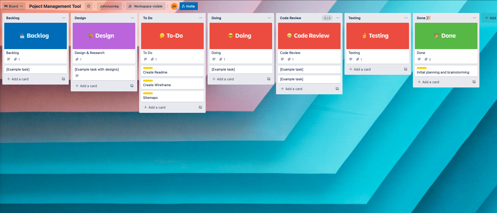

#### README

# T3A3 - Project Management Tool

TaskSprinter is a light wieght project management tool with all of my favourite features.

### Links
- Live site: https://tasksprinter.netlify.app/
- Backend/server: https://sprinttaskerbackend.herokuapp.com/
- Github Repo: https://github.com/Johnnsonkp/sprinttasker_frontend 
- Github Repo: https://github.com/Johnnsonkp/sprinttasker_api  

 
 

**_Tech Stack_**
- Programming Languages: React, Ruby on Rails 
- Source Control: GitHub
- Planning and implementation: Trello board
- Deployment Platform: Heroku, Netlify

 
 

### Trelloboard screen shots

 
 

**_Sitemap_**

 
 

**_Wireframes_**

 
 

**_Screenshots_**

 
 

**_Future Imporvements_**

- Finalise stand up/stand down feature 
- Improve layout and responsiveness 
- Finalise individual sprints feature 

